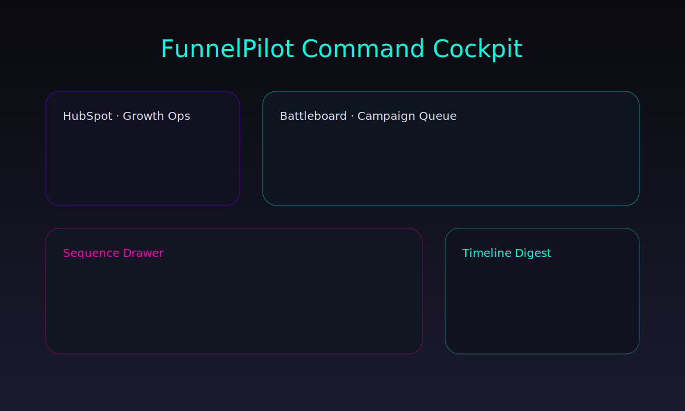

# FunnelPilot – Multi-Channel Campaign Orchestrator



[](https://render.com/deploy?repo=https://github.com/calebkotz/funnelpilot)

FunnelPilot is a portfolio-ready marketing automation showcase that pulls CRM segments from HubSpot, Salesforce, and Pipedrive, assembles AI-assisted outreach sequences, and launches them across email, LinkedIn, and SMS with a neon Second Mind aesthetic.

## Why It Matters
- **Segment intelligence** – connectors normalize CRM audiences into one orchestration engine.
- **Heuristic strategist** – fatigue cooling, momentum boosts, and deliverability reroutes fire automatically and narrate their reasoning.
- **AI-assisted copy** – optional GPT hook gives each step bespoke tone, with deterministic fallback for demos.
- **Campaign scheduler** – APScheduler runs every 6h to ignite queued playbooks and log results.
- **Telemetry cockpit** – React + Tailwind UI mirrors the Second Mind theatre with heatmaps, timelines, and KPI decks.
- **Webhook theatre** – Slack digests and LinkedIn DM simulations broadcast the launch energy.

## Stack
- **Backend:** FastAPI, APScheduler, Pydantic, httpx, uvicorn
- **Frontend:** Vite + React 18, Tailwind, Framer Motion, Recharts, lucide-react icons
- **Data:** JSON fixtures for segments, templates, campaign history
- **Testing:** pytest (unit/integration/e2e/performance/security), Playwright, Testing Library + Vitest snapshots

## Running Locally
```bash
# Backend deps
pip install -r funnelpilot/requirements.txt

# Frontend deps
cd funnelpilot/frontend && npm install

# Launch both servers
tasks/funnelpilot/scripts/run_funnel.sh  # or `make funnel`
```
- API lives at `http://localhost:8002` (Swagger at `/docs`)
- UI lives at `http://localhost:5174`

## Test Gauntlet
```bash
# Python suite
pytest funnelpilot/tests -n auto

# Frontend unit + snapshots
cd funnelpilot/frontend && npm run test:unit

# Playwright visual smoke
cd funnelpilot/frontend && npx playwright test
```

## Portfolio Assets
- UI cockpit: `artifacts/dashboard_mock.svg`
- Slack digest: `artifacts/slack_digest.svg`
- Trend chart: `artifacts/metrics_timeline.svg`
- Walkthrough script: `portfolio/walkthrough_script.md`
- Case study outline: `portfolio/case_study_outline.md`
- Daily report generator: `portfolio/reports/latest_report.html` (run `./scripts/generate_report.py`)

## Deploy Targets
- `deploy/render.yaml` for Render web service
- `deploy/fly.toml` for Fly.io
- `deploy/Dockerfile` + `Procfile` for container/Heroku flows

## One-Minute Loom Script
Read `portfolio/walkthrough_script.md` for narrated beats covering segmentation → AI tweak → launch → analytics.

## Environment Template
See `.env.template` for required API keys and webhook secrets. Copy to `.env` when provisioning cloud instances.

---

FunnelPilot is designed as a standalone portfolio repo. Use `README_extract.md` if you need quick instructions for a trimmed export.
